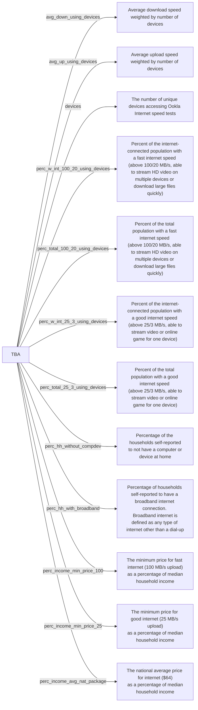

# sdc.broadband.alga_dev
Example repository of putting smaller sample data repositories together



## Quickstart
- `git submodule update --recursive --remote` to download the submodules
- Run things in the `code` directory to generate the required datasets

## Example Data Output
```python
df = pd.read_csv('01007.csv.xz', dtype={'geoid':object})
df
           geoid                    measure  moe     value  year
0   010070100011  perc_income_min_price_100  NaN  0.066667  2023
1   010070100012  perc_income_min_price_100  NaN  0.088212  2023
2   010070100051  perc_income_min_price_100  NaN  0.051231  2023
3   010070100052  perc_income_min_price_100  NaN  0.082823  2023
4   010070100053  perc_income_min_price_100  NaN  0.037103  2023
5   010070100061  perc_income_min_price_100  NaN  0.036039  2023
6   010070100062  perc_income_min_price_100  NaN  0.044219  2023
7   010070100071  perc_income_min_price_100  NaN  0.053439  2023
8   010070100072  perc_income_min_price_100  NaN  0.050261  2023
9   010070100082  perc_income_min_price_100  NaN  0.040789  2023
10  010070100093  perc_income_min_price_100  NaN  0.089700  2023
11  010070100102  perc_income_min_price_100  NaN  0.047369  2023
12  010070100111  perc_income_min_price_100  NaN  0.031500  2023
```
